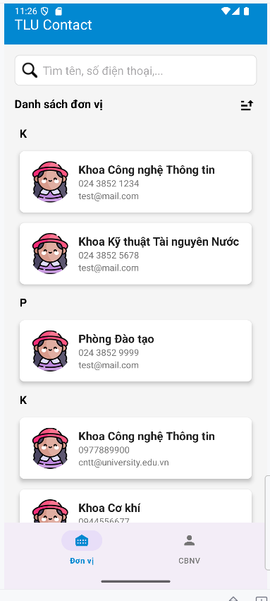
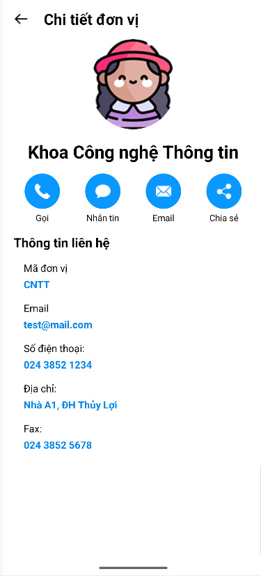

# TLU Contact

 

**TLU Contact** là một ứng dụng Android được phát triển để quản lý và tra cứu thông tin liên hệ của các đơn vị và cán bộ/giảng viên tại Đại học Thủy Lợi (TLU). Ứng dụng cung cấp giao diện thân thiện, dễ sử dụng, với các tính năng như tìm kiếm, sắp xếp, và liên hệ trực tiếp với các đơn vị hoặc cá nhân.

---

## Mục tiêu dự án

Dự án được xây dựng nhằm:

- Cung cấp một công cụ tiện lợi để sinh viên, giảng viên và cán bộ tại Đại học Thủy Lợi tra cứu thông tin liên hệ.
- Hỗ trợ các chức năng liên lạc nhanh như gọi điện, nhắn tin, gửi email và chia sẻ thông tin.
- Tối ưu trải nghiệm người dùng với giao diện đơn giản, trực quan và hiệu quả.

---

## Tính năng chính

### 1. Danh sách đơn vị
- Hiển thị danh sách các đơn vị (ví dụ: Khoa Công nghệ Thông tin, Phòng Công tác Sinh viên) theo nhóm chữ cái (A-Z).
- Hỗ trợ tìm kiếm theo tên, số điện thoại, email với kết quả hiển thị ngay khi nhập.
- Sắp xếp danh sách theo thứ tự A-Z hoặc Z-A.

### 2. Chi tiết đơn vị
- Hiển thị thông tin chi tiết của đơn vị bao gồm: mã đơn vị, email, số điện thoại, địa chỉ, fax.
- Cung cấp các nút chức năng để:
    - Gọi điện trực tiếp.
    - Nhắn tin SMS.
    - Gửi email.
    - Chia sẻ thông tin đơn vị qua các ứng dụng khác (Zalo, Messenger, v.v.).

### 3. Giao diện người dùng
- Sử dụng **BottomNavigationView** để chuyển đổi giữa các tab (Đơn vị, Cán bộ/Giảng viên).
- Giao diện thân thiện với các nút chức năng hình tròn, màu sắc nổi bật (xanh lá, cam, xanh dương).
- Hỗ trợ hiệu ứng chuyển cảnh mượt mà khi chuyển đổi giữa các màn hình.

---

## Công nghệ sử dụng

- **Ngôn ngữ lập trình**: Kotlin
- **Framework**: Android SDK
- **Giao diện**: XML với View Binding
- **Thư viện**:
    - `androidx.recyclerview.widget` để hiển thị danh sách.
    - `com.google.android.material` để sử dụng các thành phần giao diện Material Design.
- **Kiến trúc**: Sử dụng Fragment để quản lý các màn hình (UnitFragment, StaffFragment, v.v.).

---

## Cấu trúc dự án

```
TLUContact_Canhan/
├── app/
│   ├── src/
│   │   ├── main/
│   │   │   ├── java/
│   │   │   │   └── com/tlu/contact/
│   │   │   │       ├── adapter/
│   │   │   │       │   └── UnitAdapter.kt
│   │   │   │       ├── data/
│   │   │   │       │   └── SampleData.kt
│   │   │   │       ├── fragment/
│   │   │   │       │   └── UnitFragment.kt
│   │   │   │       ├── model/
│   │   │   │       │   ├── ContactUnit.kt
│   │   │   │       │   └── UnitListItem.kt
│   │   │   │       ├── MainActivity.kt
│   │   │   │       └── UnitDetailActivity.kt
│   │   │   ├── res/
│   │   │   │   ├── drawable/
│   │   │   │   │   ├── ic_sort_ascending.xml
│   │   │   │   │   ├── ic_sort_descending.xml
│   │   │   │   │   ├── back.png
│   │   │   │   │   ├── avatar.png
│   │   │   │   │   ├── phone_call.png
│   │   │   │   │   ├── speech_bubble.png
│   │   │   │   │   ├── mail.png
│   │   │   │   │   └── share.png
│   │   │   │   ├── layout/
│   │   │   │   │   ├── activity_main.xml
│   │   │   │   │   ├── activity_unit_detail.xml
│   │   │   │   │   ├── fragment_unit.xml
│   │   │   │   │   ├── unit_header_item.xml
│   │   │   │   │   └── unit_item.xml
│   │   │   │   ├── menu/
│   │   │   │   │   └── bottom_nav_menu.xml
│   │   │   │   ── values/
│   │   │   │    ├── colors.xml
│   │   │   │      ├── strings.xml
│   │   │   │      └── styles.xml
│   │   └── AndroidManifest.xml
├── build.gradle
└── README.md
```

---

## Hướng dẫn cài đặt

### Yêu cầu
- Android Studio (phiên bản mới nhất được khuyến nghị).
- Thiết bị Android hoặc trình giả lập với API 21 trở lên.

### Các bước cài đặt
1. **Clone repository**:
     ```bash
     git clone https://github.com/<your-username>/TLUContact_Canhan.git
     ```
2. **Mở dự án**:
     - Mở Android Studio.
     - Chọn **Open an existing project** và chọn thư mục `TLUContact_Canhan`.
3. **Đồng bộ dự án**:
     - Nhấn **Sync Project with Gradle Files** để tải các dependency.
4. **Chạy ứng dụng**:
     - Kết nối thiết bị Android hoặc khởi động trình giả lập.
     - Nhấn **Run** để cài đặt và chạy ứng dụng.

---

## Hướng dẫn sử dụng

1. **Mở ứng dụng**:
     - Giao diện chính gồm **BottomNavigationView** với hai tab: "Đơn vị" và "Cán bộ/Giảng viên".
2. **Tab Đơn vị**:
     - Xem danh sách các đơn vị, được nhóm theo chữ cái (A-Z).
     - Sử dụng ô tìm kiếm để lọc danh sách theo tên, số điện thoại, hoặc email.
     - Nhấn nút sắp xếp để chuyển đổi giữa A-Z và Z-A.
     - Nhấn vào một đơn vị để xem chi tiết.
3. **Chi tiết đơn vị**:
     - Xem thông tin chi tiết của đơn vị (mã đơn vị, email, số điện thoại, địa chỉ, fax).
     - Sử dụng các nút chức năng để gọi, nhắn tin, gửi email, hoặc chia sẻ thông tin.
     - Nhấn nút "Quay lại" để trở về danh sách đơn vị.

---

## Đóng góp

Chúng tôi hoan nghênh mọi đóng góp để cải thiện ứng dụng! Để đóng góp:

1. Fork repository này.
2. Tạo một branch mới:
     ```bash
     git checkout -b feature/ten-tinh-nang
     ```
3. Thực hiện các thay đổi và commit:
     ```bash
     git commit -m "Thêm tính năng XYZ"
     ```
4. Push lên branch của bạn:
     ```bash
     git push origin feature/ten-tinh-nang
     ```
5. Tạo một Pull Request.

---

## Tác giả

- **Vũ Quang Nhật**

---

## Giấy phép

Dự án này được cấp phép theo [LICENSE](./LICENSE). Xem file LICENSE để biết thêm chi tiết.
---

## Liên hệ

Nếu bạn có câu hỏi hoặc cần hỗ trợ, vui lòng liên hệ qua email: [email của bạn].